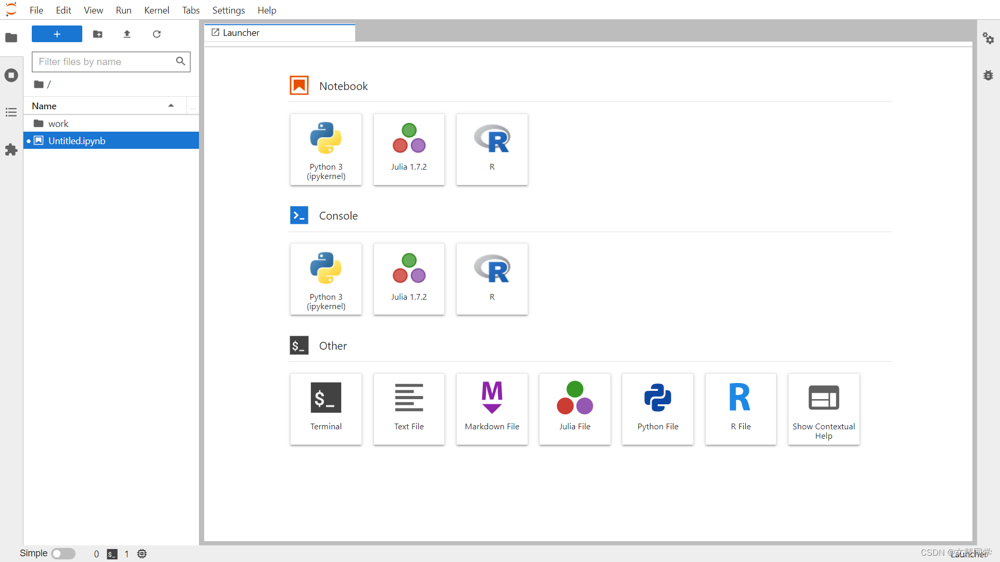

# 数算岛（SSD）开源 GPU 智算管理平台

当前版本：3.0.0

[🔥 GitHub 主仓库（当前）](https://github.com/roinli/SSD-GPU-POOL)

[🔥 帮助文档](https://huitongdao.doc.huizhidata.com/docs/)

[🔥 在线体验](https://huitongdao.platform.huizhidata.com)

> 面向科研机构与企业 AI 团队的一站式 AI 开发平台，以 GPU 池化调度为底座，覆盖数据准备、模型开发、训练、推理部署到可视分析全流程。

<p align="center">
    <a href="https://huitongdao.platform.huizhidata.com">在线体验</a> | <a href="https://huitongdao.doc.huizhidata.com/docs/">帮助文档</a>
</p>

<p align="center">
    
    
    
    
</p>

⚡️数算岛（SSD）开源 GPU 智算管理平台⚡️；⚡️一站式 AI 开发平台⚡️；⚡️GPU 池化调度⚡️；数据准备、Notebook 开发、分布式训练、模型仓库、在线推理、可视分析，NVIDIA/AMD 多型号 GPU 混合纳管、智能排队与多租户隔离，面向科研机构与企业 AI 团队的一站式 AI 全生命周期解决方案。

本仓库基于 Apache 2.0 协议发布，前端代码全开源无加密、可免费商用，适合科研机构与企业 AI 团队在此基础上快速构建自己的 AI 智算管理平台。

---

## 📖 项目介绍

系统采用前后端分离架构，前端基于 Vue 2 + Element UI 构建，界面简洁流畅。平台围绕「数据准备 → 模型开发 → 训练 → 推理部署 → 可视分析」实现 AI 研发全流程闭环：Notebook 环境秒级启动，训练任务智能排队与断点续训，模型一键部署为在线服务；底层以 GPU 池化调度为底座，支持 NVIDIA/AMD 多型号 GPU 混合纳管、按需分配与资源回收，多租户隔离、数据独立、权限分级。


---

## 📸 产品截图




---

## 🎬 产品演示

在线体验：https://huitongdao.platform.huizhidata.com

演示环境权限开放，请勿随意删除数据。本地启动体验见下方「快速开始」。

---

## 📚 项目资料

- 帮助文档：https://huitongdao.doc.huizhidata.com/docs/ （使用文档 / 部署文档）
- GitHub 主仓库：https://github.com/roinli/SSD-GPU-POOL
- 微信讨论群：jinglidream（进群前请在仓库右上角点 Star）

---

## 核心功能

#### 算力驾驶舱与大屏
全局态势一屏掌握：GPU 利用率、显存占用、节点状态、训练任务进度等关键指标实时呈现。

#### 数据准备与标注
数据集版本化管理，支持文本、图像、点云、医疗影像等多种数据标注工具，为模型训练备好数据。

#### Notebook 开发环境
秒级启动 JupyterLab / VSCode / SSH 开发环境，预置 20+ 深度学习基础镜像，资源配额一键分配。

#### 训练中心
训练任务全生命周期管理：镜像选择、分布式训练、断点续训、模型自动保存，训练过程全程可追溯。

#### 模型与算法
版本化模型仓库，支持模型上传、版本管理与在线预览；提供模型优化（量化/剪枝）、TADL 自动调参与算法管理。

#### 在线推理与云服务
训练好的模型一键部署为在线推理服务，支持批量推理任务与实时监控，服务 API 开箱即用。

#### 可视分析
训练过程可视化：指标曲线、媒体、图结构、超参对比、Embedding 等多维度分析，媲美 TensorBoard。

#### GPU 池化调度
NVIDIA/AMD 多型号 GPU 混合纳管，智能排队、按需分配、资源回收，把闲置算力真正用起来。

#### 多租户与权限
用户、角色、用户组三级权限体系，配额管理，多团队数据独立、互不干扰。

---

## 系统优势

- **GPU 池化调度底座** —— NVIDIA/AMD 多型号混合纳管，按需分配、智能排队、资源回收
- **AI 研发全流程闭环** —— 数据准备→开发→训练→推理→可视分析一条龙
- **多租户与细粒度权限** —— 数据独立、权限隔离、配额管理
- **开源可扩展** —— Apache 2.0 协议，前端代码自由定制，社区持续迭代

---

## 🚀 快速开始

环境要求：Node.js 14+（Node 18+ 需设置 `NODE_OPTIONS=--openssl-legacy-provider`）

```bash
# 1. 安装依赖
npm install

# 2. 启动开发环境
npm run dev

# 3. 浏览器访问 http://localhost:8013 登录体验
```

> 前端默认连接平台后端接口，后端地址在 `.env.development` 中通过 `VUE_APP_BASE_API` 等变量配置；后端服务部署与完整平台搭建见[帮助文档](https://huitongdao.doc.huizhidata.com/docs/)。

---

## 功能矩阵

| 🔴 数据准备 | 🟠 开发环境 | 🟡 训练中心 | 🟢 模型算法 | 🔵 在线推理 | 🟣 平台管理 |
|---|---|---|---|---|---|
| 数据集管理 | Notebook 开发环境 | 训练任务管理 | 模型仓库与版本管理 | 在线推理服务 | GPU 池化调度 |
| 数据标注（文本/图像/点云） | Web 终端 / SSH 接入 | 训练镜像管理 | 模型优化（量化/剪枝） | 批量推理任务 | 多租户与权限隔离 |
| 医疗影像管理 | 预置深度学习镜像 | 分布式训练 | 算法管理 | 服务监控 | 节点 / Pod 管理 |
| 数据文件管理 | 资源配额管理 | 断点续训与自动保存 | TADL 自动调参 | 服务 API 管理 | 资源回收与告警 |

---


## 反馈与交流

- 项目主页：https://github.com/roinli/SSD-GPU-POOL
- 微信讨论群：jinglidream（进群前请在仓库右上角点 Star）
- 欢迎通过 GitHub Issues 提交 Bug、交流方案、获取更新动态。

---

© 2026 慧知 版权所有 · 开源协议：Apache License 2.0 · 详见 [LICENSE](./LICENSE)