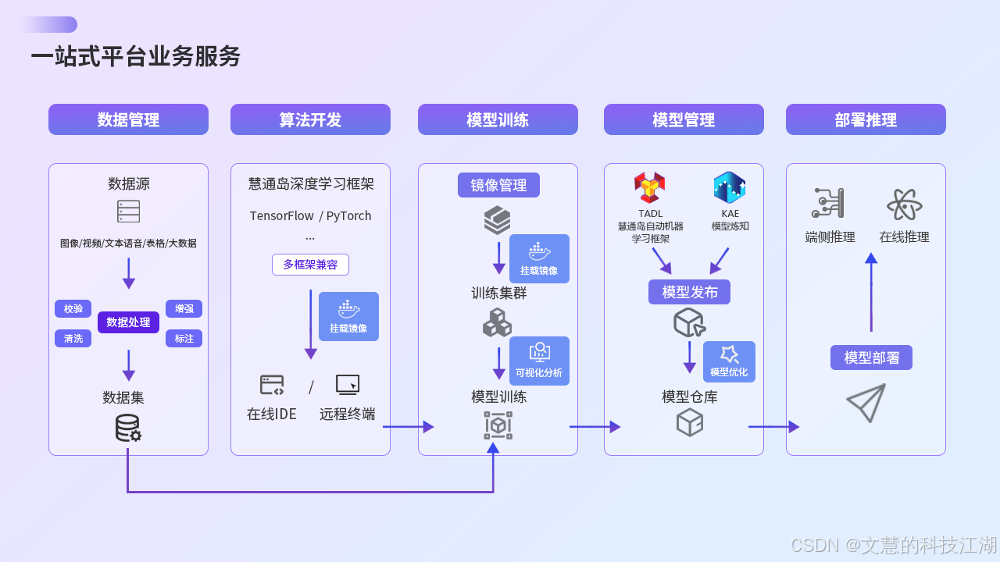
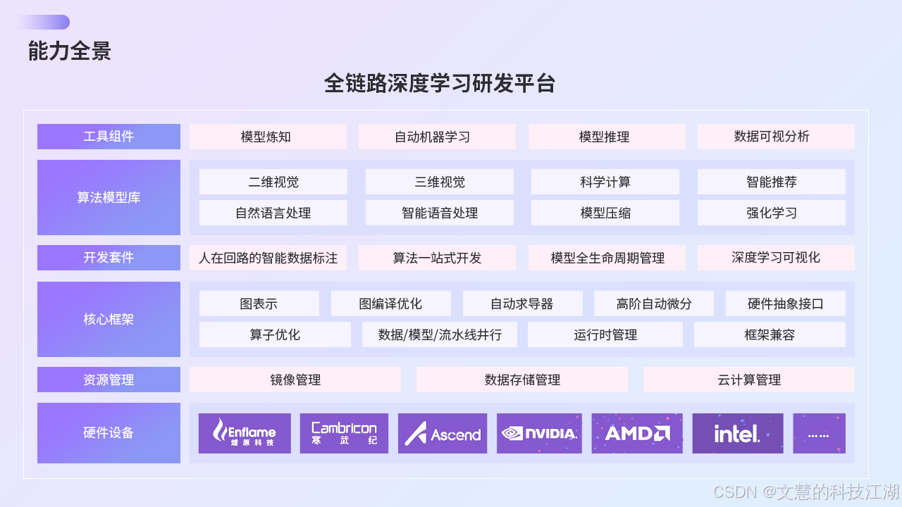
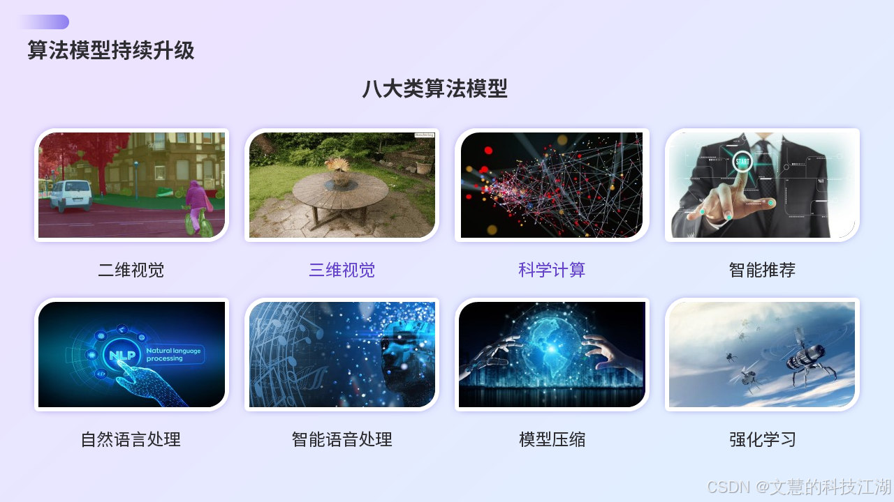
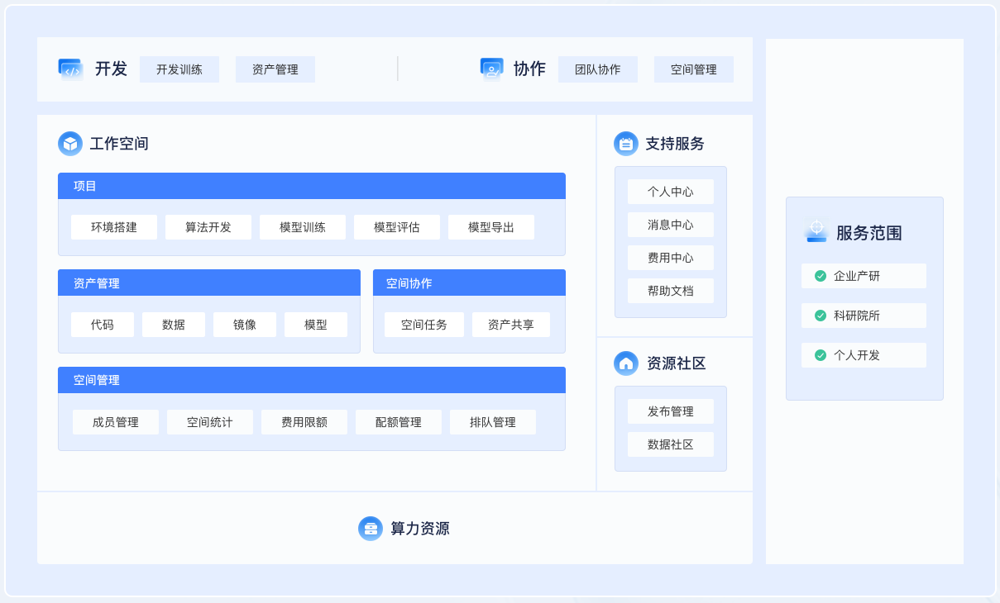
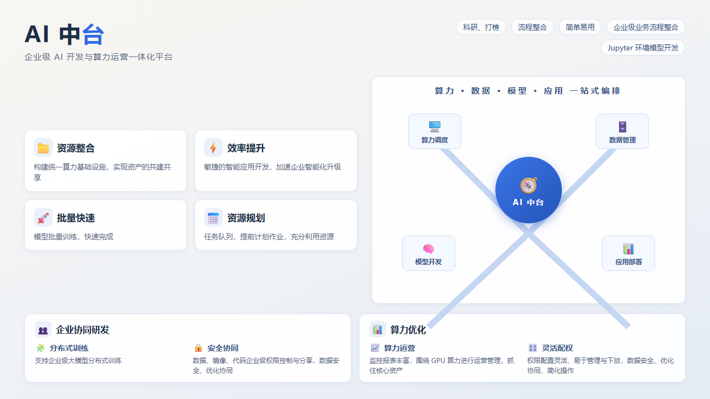
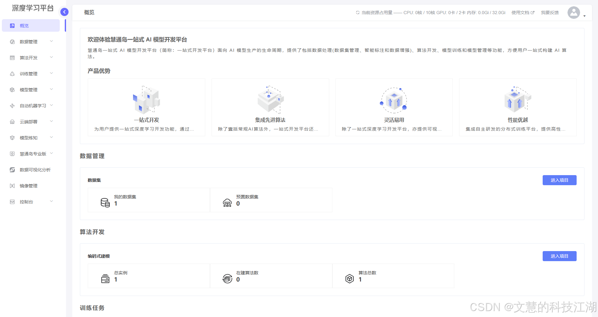
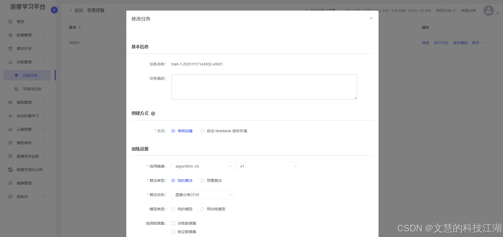
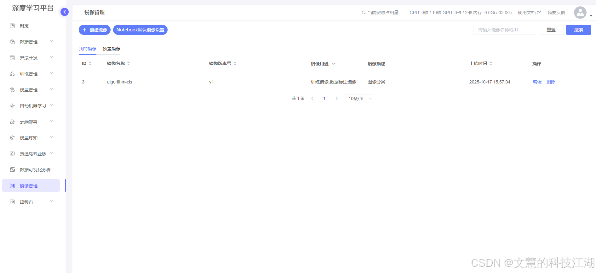
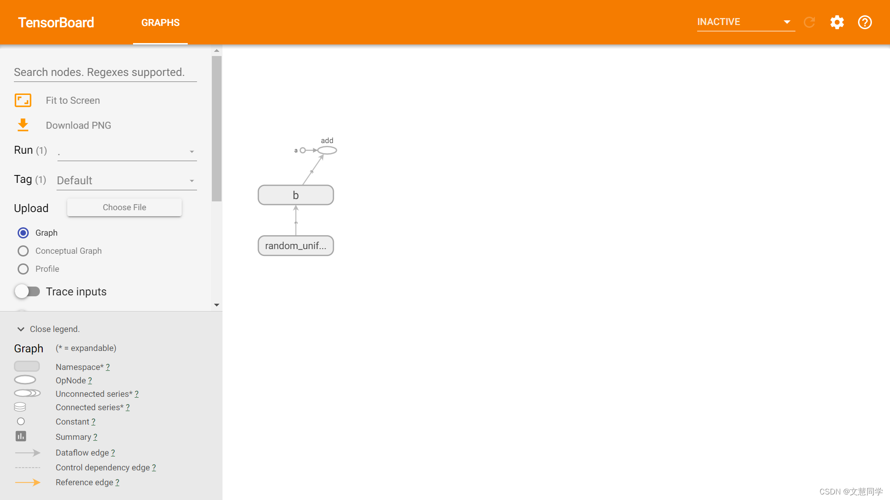

[🔥 Github 主仓库（优先更新）https://github.com/roinli/SSD-GPU-POOL ](https://github.com/roinli/SSD-GPU-POOL) | [Gitee 镜像仓库](https://github.com/roinli/SSD-GPU-POOL)

# > 原仓库因故暂停使用，本仓库为镜像项目。开源版本将持续迭代优化，欢迎提交 Issue 或加入社群交流。

## 数算岛（SSD） GPU 池化平台 | AI 全生命周期管理解决方案
### （支持训练加速/推理优化/资源调度）

---

## 文档

[文档  -  慧通岛开源人工智能平台简介 | 慧通岛开源人工智能平台   **http://huitongdao.doc.huizhidata.com**](http://huitongdao.doc.huizhidata.com/docs/)

## 演示
[演示 - 慧通岛开源人工智能平台简介 | 慧通岛开源人工智能平台   **http://huitongdao.platform.huizhidata.com**](http://huitongdao.platform.huizhidata.com/docs/)

##  简介

### 一、AI 开发面临的挑战

#### 1. GPU 资源管理困境
- **资源利用率低**：昂贵算力资源缺乏有效调度，闲置率高达 40%+
- **多租户管理难**：缺乏细粒度权限控制和资源隔离机制
- **成本不可控**：缺乏用量监控与成本分析体系

#### 2. AI 开发效率瓶颈
- **环境配置复杂**：CUDA 版本冲突、依赖包管理等消耗 30%+ 开发时间
- **协作效率低下**：代码/数据/模型缺乏版本管理和共享机制
- **训练周期长**：缺乏任务队列管理和分布式训练优化
- **资产复用困难**：实验过程不可追溯，模型迭代缺乏系统化管理

---

### 二、平台核心价值

#### 1. 全流程 AI 开发管理
- 覆盖数据标注 → 模型开发 → 训练优化 → 推理部署全生命周期
- 支持 TensorFlow/PyTorch/MXNet 等主流框架的异构计算调度

#### 2. 智能资源调度引擎
- 动态 GPU 池化技术：支持 NVIDIA/AMD 多型号 GPU 混合调度
- 智能排队系统：支持抢占式任务调度和资源回收机制
- 多租户隔离：基于 cgroups 的硬件资源隔离，QoS 保障

#### 3. 企业级功能特性
- 分布式训练加速：优化 AllReduce 算法，线性加速比达 0.95+
- 可视化监控：实时展示 GPU 利用率/显存占用/网络吞吐等 50+ 指标
- 安全合规：符合 GDPR 的数据加密传输和存储方案

---

### 三、功能架构

#### 核心模块说明：
1. **开发环境**
   - 支持 JupyterLab/VSCode Remote/SSH 多种接入方式
   - 预置 20+ 深度学习基础镜像，秒级环境启动
   - 资源配额管理（CPU/GPU/Memory/Disk）

2. **训练中心**
   - 分布式训练自动拓扑发现
   - 断点续训和模型自动保存
   - TensorBoard 可视化集成

3. **资产中心**
   - 版本化模型仓库（支持 ONNX/PMML 格式）
   - 数据集版本控制（兼容 S3/HDFS 存储）
   - 实验过程全记录（超参/指标/日志）

4. **调度系统**
   - 智能批处理作业调度
   - 基于公平份额的资源分配算法
   - 硬件故障自动迁移

### 五、典型应用场景

#### 场景 1：计算机视觉研发
- 支持 ImageNet 级数据集分布式预处理
- 自动混合精度训练（AMP）
- 模型量化压缩工具链

#### 场景 2：NLP 模型训练
- 支持百亿参数大模型训练
- 梯度累积与显存优化技术
- HuggingFace 生态深度集成

#### 场景 3：边缘计算部署
- 模型自动转换为 TensorRT 格式
- 服务网格化部署管理
- 在线模型热更新

---

### 六、客户案例

#### 案例 1：某自动驾驶公司
- **挑战**：千卡集群利用率不足 50%，训练任务排队严重
- **方案**：部署调度系统 + 分布式存储加速
- **效果**：资源利用率提升至 82%，训练周期缩短 40%

#### 案例 2：某医疗 AI 实验室
- **需求**：满足 HIPAA 合规的协作平台
- **方案**：多租户隔离 + 数据加密传输
- **成果**：建立 20+ 研究员的协同开发环境

### 八、产品截图

